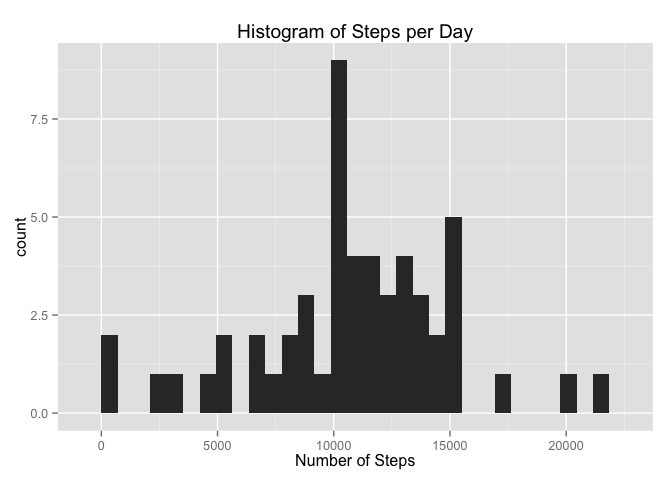
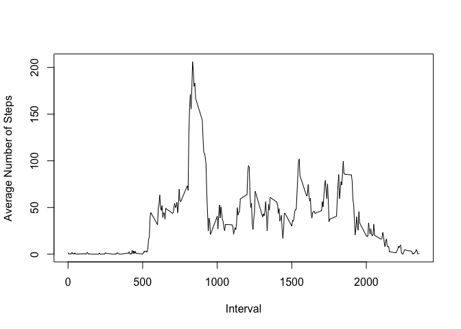
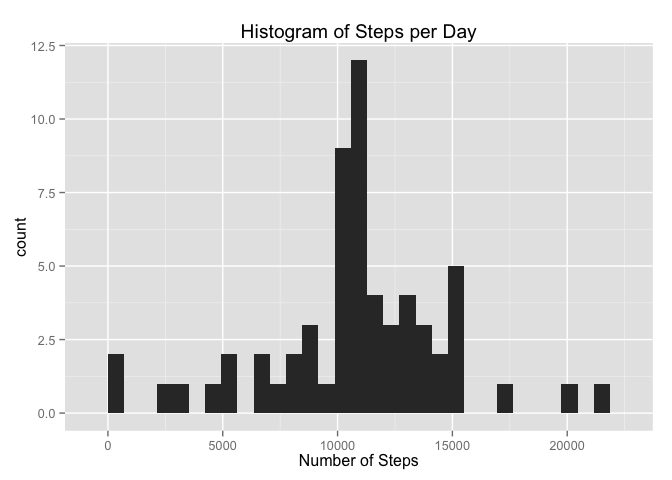
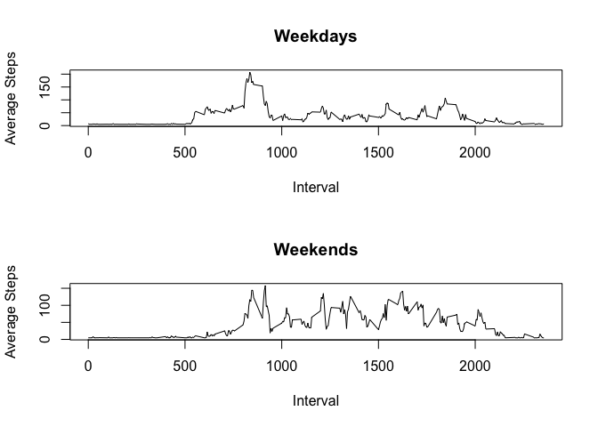

# Reproducible Research: Peer Assessment 1


## Loading and preprocessing the data

```r
library(readr)
df <- read.csv("activity.csv")
```


## What is mean total number of steps taken per day?

```r
library(plyr)
library(ggplot2)
daily.sum <- ddply(df, .(date), function(x) sum(x$steps))
daily.mean <- mean(daily.sum$V1, na.rm=TRUE)
daily.median <- median(daily.sum$V1, na.rm=TRUE)

qplot(daily.sum$V1, geom="histogram", main = "Histogram of Steps per Day", xlab="Number of Steps")
```

```
## stat_bin: binwidth defaulted to range/30. Use 'binwidth = x' to adjust this.
```

 

The mean number of steps each day was 1.0766189\times 10^{4}.

The median number of steps each day was 10765.

## What is the average daily activity pattern?


```r
int.mean <- ddply(df, .(interval), function(x) mean(x$steps, na.rm=TRUE))
plot(int.mean$interval, int.mean$V1, type="l", xlab="Interval", ylab="Average Number of Steps")
```

 

The 5 minute interval starting at 835 contains the maximum average number of steps. 

## Imputing missing values

The total number of NAs in the dataset is 2304.

Replace NA steps with the daily average in a new dataframe ndf.


```r
ndf <- df
ndf$steps <- ifelse(is.na(df$steps), mean(df$steps, na.rm=TRUE), df$steps)
ndaily.sum <- ddply(ndf, .(date), function(x) sum(x$steps))
ndaily.mean <- mean(ndaily.sum$V1, na.rm=TRUE)
ndaily.median <- median(ndaily.sum$V1, na.rm=TRUE)
qplot(ndaily.sum$V1, geom="histogram", main = "Histogram of Steps per Day", xlab="Number of Steps")
```

```
## stat_bin: binwidth defaulted to range/30. Use 'binwidth = x' to adjust this.
```

 

The mean number of steps each day was 1.0766189\times 10^{4}.

The median number of steps each day was 1.0766189\times 10^{4}.

Do these values differ from the estimates from the first part of the assignment? 
Previously the mean and median were different, but not they're the same.

What is the impact of imputing missing data on the estimates of the total daily number of steps?
It makes the median equal the mean.

## Are there differences in activity patterns between weekdays and weekends?

```r
library(timeDate)
ndf$type <- ifelse(isWeekday(as.Date(ndf$date, format="%Y-%m-%d")), "weekday", "weekend")
ddf <- ndf[ndf$type=="weekday", ]
ddf.mean <- ddply(ddf, .(interval), function(x) mean(x$steps, na.rm=TRUE))
edf <- ndf[ndf$type=="weekend", ]
edf.mean <- ddply(edf, .(interval), function(x) mean(x$steps, na.rm=TRUE))
par(mfrow=c(2,1)) 
plot(ddf.mean$interval, ddf.mean$V1, type="l", xlab="Interval", ylab="Average Steps", main="Weekdays")
plot(edf.mean$interval, edf.mean$V1, type="l", xlab="Interval", ylab="Average Steps", main="Weekends")
```

 

